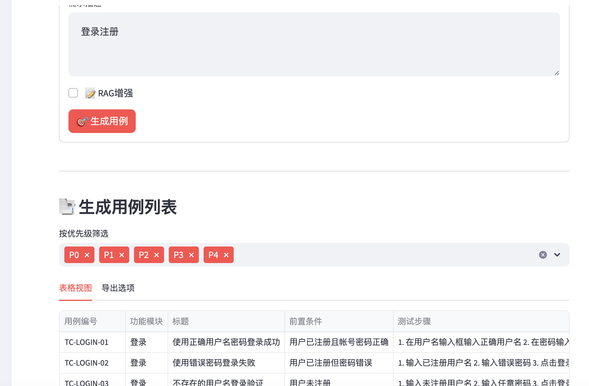
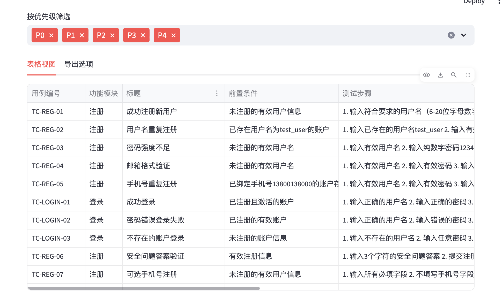
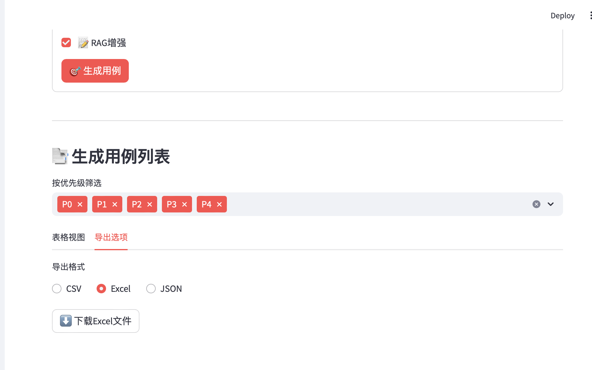
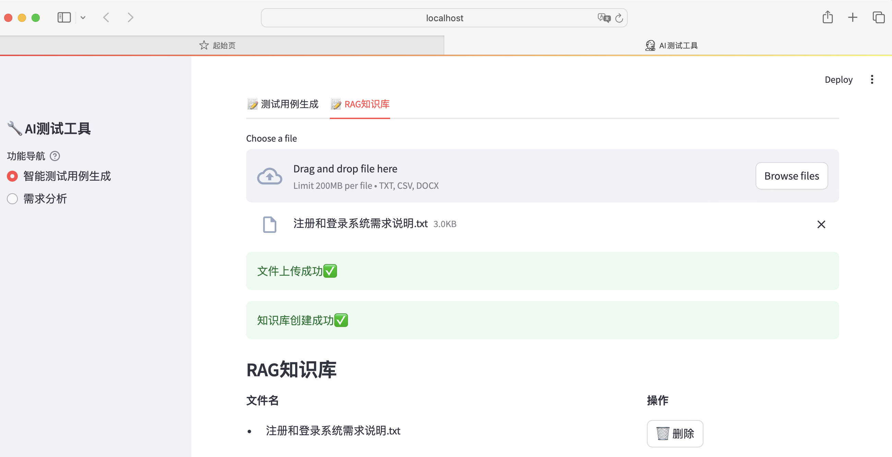
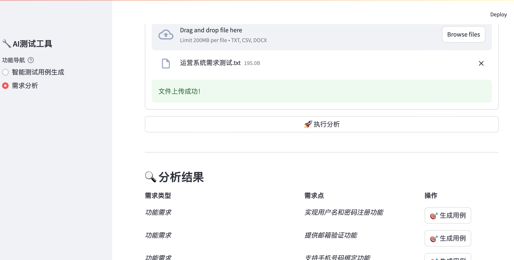

# 项目名称
> 基于langchain+DeepSeek的自动测试用例生成及需求分析的测试工具

## 🚀 功能展示
##### 📚需求描述自动生成测试用例

##### 非RAG

##### RAG

#####  下载EXCEL

###### 📚创建知识库


###### 📚需求分析


### 环境要求
- Python 3.9+
- 下载嵌入模型nomic-embed-text:latest（可以本地部署ollama然后下载）
- 申请API Key或者本地部署
- 当前目录需要新建
 - .env文件配置
```bash

TENCENT_API_KEY=
TENCENT_BASE_URL=
OLLAMA_BASE_URL=http://127.0.0.1:11434
DEEPSEEK_BASE_URL=
DEEPSEEK_API_KEY=

```
### 依赖包
```bash
# 安装依赖

pip install -r requirements.txt

# 项目启动
streamlit run main.py

```
### 后续计划
- [ ] 增加测试用例历史数据RAG增强
- [ ] 增加需求分析及测试用例生成修改反馈
- [ ] 考虑接口测试用例自动生成（pytest脚本）、UI测试用例自动生成（playwright）
